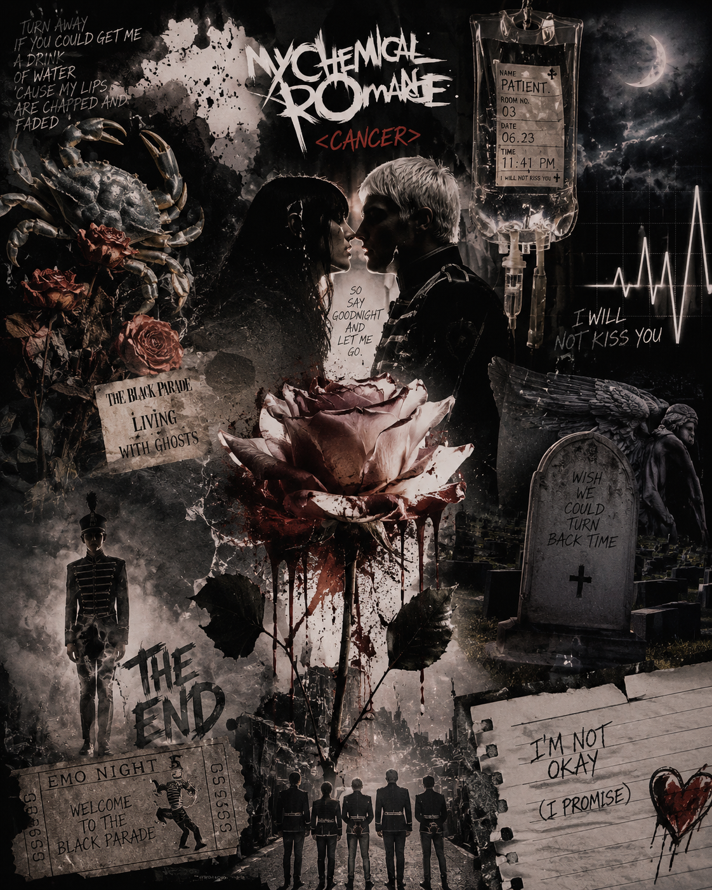

# cancer

My Chemical Romance's song *cancer*, made by Gerard way [portrays the perspective of a patient facing death.](https://www.youtube.com/watch?v=wc2s9skF_58&list=RDwc2s9skF_58&start_radio=1) The narrator isis gradually weakened by cancer and, in an irreversible condition, prepares to say farewell to his family and lover. Rather than resisting death violently or fearing it, he accepts it in a resigned manner and maintains a calm and composed attitude until the end. The reason this song is particularly striking is that, as discussed in “Week 14: Life is short, but art (medicine) is long?”, the representation of cancer is not framed through an extreme narrative of suffering or struggle, but instead conveys the proximity of death through ordinary language and bodily sensations in a highly realistic manner. For example, requests for water and references to dry lips allow listeners to directly feel the patient’s weakness and exhaustion. In addition, the depiction of hair loss reflects physical changes caused by chemotherapy and suggests that the patient can no longer maintain his former healthy self. However, the speaker does not exaggerate his emotions in response to these changes. Rather, he recognizes and accepts his condition and organizes his farewell to those around him. This attitude can be interpreted not simply as resignation, but also as an expression of autonomy in preparing for death and an awareness of a dignified end of life. In particular, the statement that “leaving is the hardest part” suggests that the greatest tragedy is not physical pain, but the separation from loved ones. This reframes illness not merely as a medical condition, but as an experience that transforms human life and relationships. The musical structure also effectively supports these themes. From the analytical perspective of “Week 5: Can pain be expressed through music?” and “Week 12: Illness and music have narratives,” the song is characterized by a slow tempo and simple melody, with highly restrained instrumentation. This minimal sound emphasizes emptiness and isolation rather than dramatic emotional outbursts, conveying the speaker’s resigned psychological state. As the song progresses, the gradually fading atmosphere and dissolving cadence evoke the process of life slowly disappearing. This musically extends the themes of physical decline and acceptance of death found in the lyrics. Considering My Chemical Romance’s typical musical identity, known for intense and explosive sound, this restrained composition becomes even more striking. By deliberately excluding the band’s characteristic emotional intensity, the death and solitude of the speaker are revealed in a colder and more solemn manner, further highlighting the song’s sadness and emptiness. In this way, Cancer does not merely describe the pain of illness; it allows listeners to indirectly experience the patient’s inner world and the loss of relationships. Even without sharing the same experience, listeners come to empathize with the patient’s emotions, thereby understanding illness and death from a more human perspective. Moreover, music serves not only as a medium through which the patient expresses and accepts his suffering, but also as a means for listeners to understand others’ pain and form emotional support. Therefore, Cancer demonstrates how music can go beyond simple artistic expression to share suffering, generate empathy, and potentially enable emotional healing. This aspect can also be compared with the band Thornapple’s Seoul. While Cancer depicts the physical weakening of a cancer patient and a calm farewell before death, Seoul more intensely expresses the alienation and dissolution of existence experienced by an individual within a vast city. Both songs share the common tendency of expanding human suffering beyond a purely physical condition into experiences of relational loss and isolation. However, whereas Cancer conveys acceptance of death through restrained arrangement and a calm narrative, Seoul delivers inner anxiety and despair through gradually intensifying sound and explosive emotional expression. This contrast highlights the diverse ways in which music can express suffering and its narrative possibilities. Furthermore, these musical experiences are connected to the possibility that music can influence human emotional and physical states. Music can function not only as emotional comfort but also as a medium that helps individuals recognize their inner state and regulate emotions, which may partially relate to physiological responses such as reduced tension and decreased anxiety. (HYQ Portfolio Q1, Q2 reflection) In addition, these effects show variability depending on an individual’s psychological characteristics and the type of suffering experienced, suggesting that music is not a universal therapeutic tool but rather a conditional and variable experience. (Reflection of Future Question development background) In conclusion, Cancer extends beyond artistic representation of suffering to demonstrate the potential for empathy and emotional healing, while also revealing the limitations and individual variability of its effects. This critical perspective expands into the Future Question regarding how music contributes to pain relief and emotional healing, and what its medical and social limitations may be. (Reflection of HYQ Portfolio Future Question)

# cancer

밴드 My Chemical Romance의 보컬 Gerard Way가 작곡한 곡 Cancer는 죽음을 앞둔 ‘환자(The Patient)’의 시점을 다룬다. 화자는 암으로 인해 점점 쇠약해지고 있으며, 이미 회복이 불가능한 상태에서 가족과 연인에게 작별을 준비한다. 그는 자신의 죽음을 격렬하게 저항하거나 두려워하기보다 체념적으로 받아들이며, 끝까지 담담한 태도를 유지한다. 이 곡이 인상적인 이유는 "14주차: 인생은 짧고 예술(의술)은 길다?"에서 보았듯이 예술가의 암이라는 질병을 표현하는 방식이 극적인 고통이나 투병의 서사로 표현되지 않고, 매우 일상적인 언어와 신체 감각을 통해 죽음에 가까워진 상태를 현실적으로 보여 준다. 예를 들어 물을 달라는 부탁이나 마른 입술에 대한 언급은 환자의 쇠약함과 피로를 직접적으로 체감하게 만든다. 또한 머리카락이 빠지는 모습은 항암치료로 인한 신체적 변화를 드러내며, 환자가 더 이상 건강했던 자신의 모습을 유지할 수 없음을 암시한다. 그러나 화자는 이러한 변화 앞에서도 자신의 감정을 과장하지 않는다. 오히려 자신의 상태를 스스로 인식하고 받아들이며 주변 사람들과의 이별을 정리한다. 이러한 태도는 단순한 체념이 아니라 마지막 순간까지 자신의 삶을 스스로 정리하려는 자기결정권과 품위 있는 죽음에 대한 의식으로도 해석할 수 있다. 특히 “떠나는 것이 가장 힘들다”는 내용은 육체적 고통보다 사랑하는 사람들과의 관계가 끊어지는 사실이 더 큰 비극임을 보여 준다. 이는 질병을 단순한 의학적 상태가 아니라 인간의 삶과 관계를 변화시키는 경험으로 인식하게 만든다. 음악적 구성 역시 이러한 주제를 효과적으로 뒷받침한다. "5주차 수업: 고통은 음악으로 표현될 수 있는가?"/ "12주차: 질병과 음악에는 서사가 있다"라는 두 수업에서의 분석적 측면에서, 이 곡은 느린 템포와 단순한 선율을 중심으로 진행되며, 악기 사용 또한 절제되어 있다. 이러한 미니멀한 사운드는 극적인 감정 폭발 대신 공허함과 고독을 강조하며, 화자의 체념적인 심리를 청각적으로 전달한다. 또한 곡이 진행될수록 점차 가라앉는 분위기와 사라져 가는 듯한 종지는 환자의 생명이 서서히 소멸해 가는 과정을 연상시킨다. 이는 신체적 쇠약과 죽음의 수용이라는 가사의 내용을 음악적으로 확장하는 역할을 한다. 특히 강렬하고 폭발적인 사운드로 알려진 My Chemical Romance의 기존 음악적 성향을 고려하면, 이 곡의 절제된 구성은 더욱 두드러진다. 밴드 특유의 격정성을 의도적으로 배제함으로써 화자의 죽음과 고독이 더욱 차갑고 비장하게 드러나며, 곡이 전달하는 슬픔과 공허함 역시 한층 선명하게 부각된다. 이처럼 「Cancer」는 질병의 고통을 단순히 묘사하는 데 그치지 않고, 청자가 환자의 내면과 관계의 상실을 간접적으로 경험하도록 만든다. 청자는 음악을 통해 자신의 경험이 아님에도 환자의 감정에 공감하게 되며, 이를 통해 질병과 죽음을 보다 인간적인 관점에서 이해할 수 있다. 또한 음악은 환자가 자신의 고통을 표현하고 받아들이는 통로가 될 뿐만 아니라, 청자에게는 타인의 고통을 이해하고 정서적 지지를 형성하게 하는 매개체가 될 수 있다. 따라서 「Cancer」는 음악이 단순한 예술적 표현을 넘어 고통을 공유하고 공감을 형성하며, 나아가 정서적 치유를 가능하게 하는 중요한 역할을 수행할 수 있음을 보여 주는 작품이라고 할 수 있다. [이러한 점은 쏜애플의 「서울」과도 비교해 볼 수 있다.](https://github.com/hskye79/medicalhumanitiesmusic-2026-1/blob/main/choi-minseok.md) 「Cancer」가 암 환자의 신체적 쇠약과 임종을 앞둔 이별을 담담하게 그려 낸다면, 「서울」은 거대한 도시 속에서 개인이 경험하는 소외와 존재의 소멸을 보다 격정적으로 표현한다. 두 곡 모두 인간의 고통을 단순한 신체적 문제로 환원하지 않고 관계의 상실과 고립의 경험으로 확장한다는 공통점을 지닌다. 그러나 「Cancer」가 절제된 편곡과 차분한 서사를 통해 죽음의 수용을 드러내는 반면, 「서울」은 점진적으로 고조되는 사운드와 폭발적인 감정 표현을 통해 내면의 불안과 절망을 전달한다. 이러한 차이는 음악이 고통을 표현하는 다양한 방식과 서사적 가능성을 보여 준다. 나아가 이러한 음악적 경험은 음악이 인간의 정서와 신체 상태에 영향을 미칠 수 있는 가능성과도 연결된다. 음악은 감정적 위로를 넘어 개인이 내면을 인식하고 정서를 조절하도록 돕는 매개체로 기능할 수 있으며, 이는 긴장 완화나 불안 감소와 같은 생리적 반응과도 부분적으로 관련될 수 있다.(HYQ 포트폴리오 Q1, Q2 반영) 또한 이러한 효과는 개인의 심리적 특성과 고통의 유형에 따라 다르게 나타나는 비일관성을 가지며, 음악이 보편적 치료 수단이라기보다 조건적이고 가변적인 경험임을 보여 준다.(HYQ 포트폴리오 Future Question 도출 배경 반영) 결론적으로 「Cancer」는 고통의 예술적 표현을 넘어 공감과 정서적 치유의 가능성을 보여 주지만, 그 효과의 개인차와 한계를 함께 지닌다. 이러한 문제의식은 음악이 통증 완화와 정서적 치유에 어떻게 기여하며, 그 의학적·사회적 한계는 무엇인지에 대한 Future Question으로 확장된다.(HYQ 포트폴리오 Future Question 반영)

# [Welcome to the black parade](https://www.youtube.com/watch?v=RRKJiM9Njr8&list=RDRRKJiM9Njr8&start_radio=1)

The song I want to play at my funeral is My Chemical Romance’s . To be honest, it is difficult to explain exactly why it has to be this song. It is simply a song I have loved for a very long time, and strangely enough, it is the first one that comes to mind whenever I think of death or parting. This song accepts and redefines death in a completely different manner compared to the aforementioned track, . While  exhibits a "passive, inward-looking resignation" that calmly accepts the physical dissolution caused by illness,  adopts an "active, outward-looking transcendence" that treats death as an extension of life and the beginning of a new memory. This track is not entirely sorrowful. It begins quietly and lonely with a single, solitary piano note, but as the song develops, the sound grows larger and more magnificent. Amidst the grief, it delivers a powerful message that one must carry on. Therefore, if this music were to echo through my funeral, it would not feel like a place trapped solely in the tragic fact of losing someone; instead, it would become a celebration where everyone gathers to commemorate the traces and memories that person left behind. I especially love the phrase "We'll carry on" in the lyrics. This is a declaration that physical erasure does not equate to the complete destruction of one's existence. It is enough for me if the people who remember me continue living their respective lives after I am gone, occasionally smiling as they think of me. While parting in  is the pain of severed relationships, parting in  is a transition of the relationship's form—shifting from "survival" to "memory and inheritance." Thus, listening to this song evokes a grand scene of passing the baton to the next generation after a long march, rather than making death feel fearful. Instead of a funeral home filled only with weeping, I hope this song blares loudly in my final moments. I want people to mourn, but at the same time, hum along to the tune, sending me off with the mindset of "Even so, we will carry on" when the final chorus explodes. Perhaps the reason I want to play this song at my funeral is not to glamorize death in some special way. It is because the song embodies a subjective, resilient attitude that acknowledges the absolute truth of the end without collapsing under it. It sounds like a confident response directed at those left behind, as if the patient from , after passing away with dignity, is shouting out: "I have led my life well up to this point, so now, do not stop and keep marching forward." For that reason, I have chosen this track as the music for my final stage.

# Welcome to the black parade

내가 장례식에서 틀고 싶은 노래는 My Chemical Romance의 이다. 사실 왜 꼭 이 노래여야 하는지 명확하게 설명하기는 어렵다. 그냥 오래전부터 좋아했던 노래이고, 이상하게도 죽음이나 이별을 떠올릴 때 가장 먼저 생각난다. 이 노래는 앞서 살펴본 와는 전혀 다른 방식으로 죽음을 수용하고 재정의한다. 가 질병으로 인한 신체의 소멸을 담담히 받아들이는 '소극적·내향적 체념'의 태도를 보여준다면, 는 죽음을 삶의 연장선이자 새로운 기억의 시작으로 대하는 '적극적·외향적 초월'의 태도를 취한다. 이 곡은 마냥 슬프기만 한 곡이 아니다. 처음에는 단 하나의 피아노 음으로 조용하고 쓸쓸하게 시작하지만, 곡이 전개될수록 사운드가 점차 커지고 웅장해지면서 슬픔 속에서도 앞으로 나아가야 한다는 강렬한 메시지를 들려준다. 그래서 장례식에서 이 음악이 흘러나온다면 누군가를 잃었다는 비극적인 사실에만 머무는 게 아니라, 그 사람이 남긴 흔적과 기억을 다 함께 기념하는 축제가 될 것 같다. 특히 가사에 나오는 "We'll carry on(우리는 계속해 나갈 것이다)"이라는 구절이 좋다. 이는 육체의 소멸이 곧 존재의 완전한 파멸을 의미하지 않는다는 선언이다. 내가 떠난 뒤에도 나를 기억하는 사람들이 각자의 삶을 계속 살아가고, 가끔은 나를 떠올리며 웃어줄 수 있다면 그것으로 충분하다. 에서의 이별이 관계의 단절로 인한 아픔이었다면, 에서의 이별은 관계의 형태가 '생존'에서 '기억과 계승'으로 전환되는 과정이다. 따라서 이 노래를 들으면 죽음이 두렵다기보다, 하나의 긴 행진이 끝나고 다음 사람들에게 바통을 넘기는 당당한 장면이 떠오른다. 장례식장에 울음소리만 가득한 것보다, 마지막 순간만큼은 이 노래가 크게 울려 퍼졌으면 좋겠다. 사람들은 슬퍼하면서도 동시에 노래를 따라 흥얼거리고, 마지막 후렴이 터질 때는 "그래도 우리는 계속 나아간다"는 마음으로 나를 보내줬으면 한다. 어쩌면 내가 이 노래를 장례식에서 틀고 싶어 하는 이유는 죽음을 특별하게 미화해서가 아니다. 끝이라는 엄연한 사실을 인정하면서도 거기에 무너지지 않는 주체적인 태도가 담겨 있기 때문이다. 마치 의 환자가 품위 있게 숨을 거둔 뒤, 남겨진 이들을 향해 "나도 여기까지는 내 삶을 잘 이끌고 왔으니, 이제 너희는 멈추지 말고 계속 가라" 하고 외치는 당당한 응답처럼 들리기에, 나는 이 곡을 내 마지막 무대의 음악으로 선택했다.
